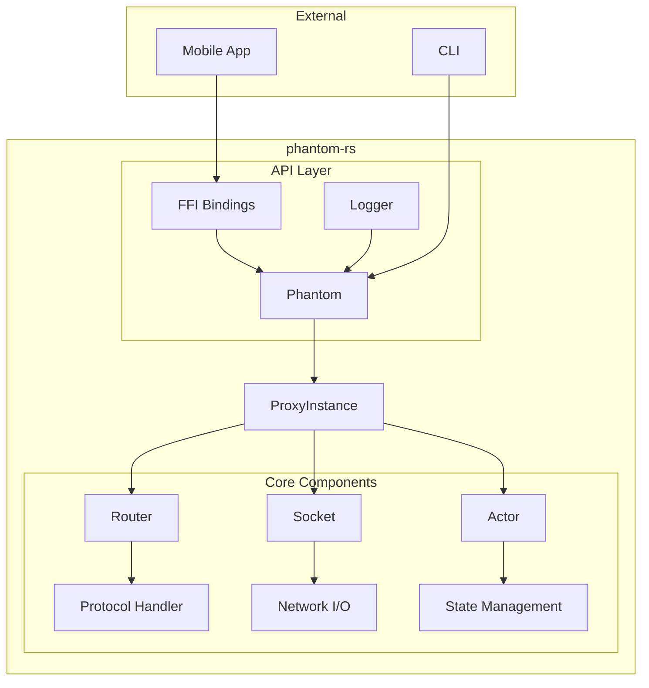
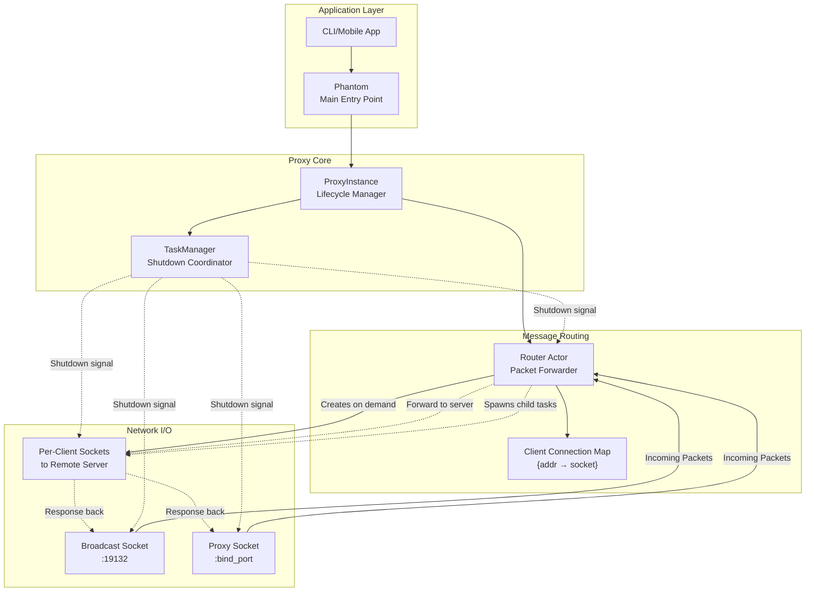

# Phantom Architecture

## Components

```mermaid
graph TD
    subgraph phantom-rs
        A[Phantom] --> B[ProxyInstance]
        B --> C[Router]
        B --> D[Socket]
        B --> E[Actor]

        subgraph Core Components
            C --> F[Protocol Handler]
            D --> G[Network I/O]
            E --> H[State Management]
        end

        subgraph API Layer
            I[FFI Bindings] --> A
            J[Logger] --> A
        end
    end

    subgraph External
        K[CLI] --> A
        L[Mobile App] --> I
    end
```

## Interactions

```mermaid
graph TD
    subgraph "Application Layer"
        CLI["CLI/Mobile App"]
        Phantom["Phantom<br/>Main Entry Point"]
    end

    subgraph "Proxy Core"
        ProxyInstance["ProxyInstance<br/>Lifecycle Manager"]
        TaskManager["TaskManager<br/>Shutdown Coordinator"]
    end

    subgraph "Message Routing"
        Router["Router Actor<br/>Packet Forwarder"]
        ClientMap["Client Connection Map<br/>{addr → socket}"]
    end

    subgraph "Network I/O"
        BcastSocket["Broadcast Socket<br/>:19132"]
        ProxySocket["Proxy Socket<br/>:bind_port"]
        ClientSockets["Per-Client Sockets<br/>to Remote Server"]
    end

    %% Main flow
    CLI --> Phantom
    Phantom --> ProxyInstance
    ProxyInstance --> Router
    ProxyInstance --> TaskManager

    %% Network to router
    BcastSocket -->|"Incoming Packets"| Router
    ProxySocket -->|"Incoming Packets"| Router

    %% Router manages client connections
    Router --> ClientMap
    Router -->|"Creates on demand"| ClientSockets

    %% Data flow
    Router -.->|"Forward to server"| ClientSockets
    ClientSockets -.->|"Response back"| BcastSocket
    ClientSockets -.->|"Response back"| ProxySocket

    %% Shutdown coordination
    TaskManager -.->|"Shutdown signal"| Router
    TaskManager -.->|"Shutdown signal"| BcastSocket
    TaskManager -.->|"Shutdown signal"| ProxySocket
    TaskManager -.->|"Shutdown signal"| ClientSockets

    %% Actor spawning
    Router -.->|"Spawns child tasks"| ClientSockets
```
